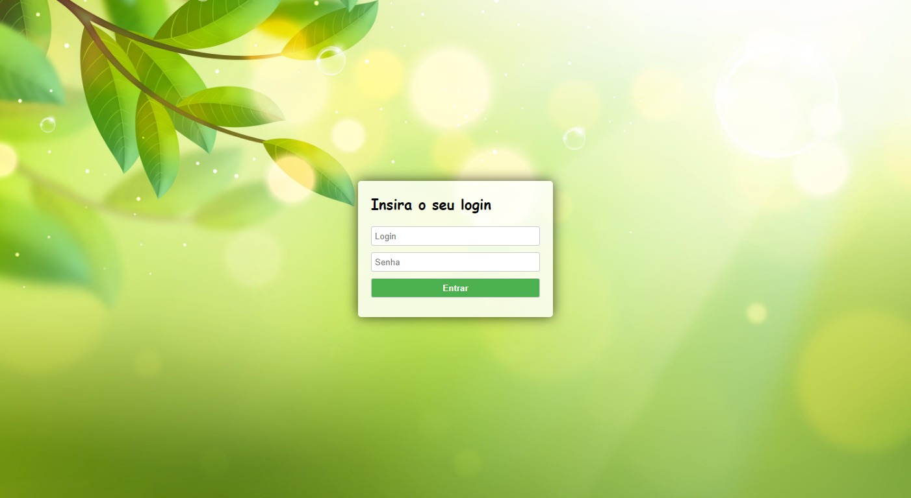

# e-mail challenge: Construindo uma página de login completa - [EBAC](https://ebaconline.com.br/webinars/prog-emailchallenge-2023-05-01-02-03-04-05)
Professor: Pedro Brocaldi  

Página de login funcional que se conecta a um banco de dados. 

Tecnologias utilizadas: `HTML, CSS, JavaScript, Node.js e Firebase`  

 
## Conteúdo do minicurso:  
    * Fundamentos  
    * Conheça os fundamentos de programação para criação de páginas web.  
    * Página + banco de dados.  
    * Saiba como realizar a integração da sua página com o banco de dados.  
    * Boas práticas.  
    * Receba dicas de boas práticas e como organizar o seu projeto.  
    
    
[Link do projeto no Firebase](https://tela-login-de6a2.web.app/)  
Login: admin  
Senha: admin  

  

# Instalando o Node.js LTS   
https://nodejs.org/en/download  

## Verificando a versão instalada  
Sempre que estiver em dúvidas sobre a versão do Node instalada em sua máquina, você pode executar o comando abaixo em um terminal.  
`node --version`  

## Instalando pacotes com NPM  
O NPM é o gerenciador de pacotes do Node que vem junto em sua instalação. Para verificar a versão do NPM instalada, você pode executar o seguinte comando:  
`npm --version`  

# Hospedando o projeto no Firebase:  
https://firebase.google.com/?hl=pt  
1 - Nomear o projeto  
2 - Criar o projeto  
3 - Acessar: Visão geral do projeto/Cloud Firestore/Hosting  
4 - Clicar em "vamos começar"  
5 - Executar o prompt de comando do Windows como admin  
6 - cd endereço da pasta do projeto  
7 - `npm install -g firebase-tools`  -> Próxima  
6 - Fazer login no Google: `firebase login`  -> `Y` (yes) -> `Permitir` no navegador    
7 - Iniciar seu projeto: `firebase init`  -> `Y` (yes) [Você está pronto para prosseguir?]  
8 - Selecionar: `Hosting: Configure files for Firebase Hosting and (optionally) set up GitHub Action deploys`.  
* Hospedagem: configure arquivos para Firebase Hosting e (opcionalmente) configure o GitHub Action deploys  

9 - Selecionar: `Use an existing project`  [Selecionar um projeto existente?]  
10 - Selecione o projeto que você criou.  
11 - Você quer usar diretório público? ENTER  
12 - Configurar uma página única do index.html? `Y` (yes)  
13 - Deseja colocar Deploys automáticos no GitHub? `N` (não)  
14 - Atualizar a pasta e copiar os arquivos do projeto (HTML, CSS, JS, IMG) na pasta `public`  
15 - No prompt digitar: `firebase deploy`  
16 - Copie o endereço do Hosting URL e cole no navegador.  
